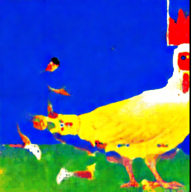
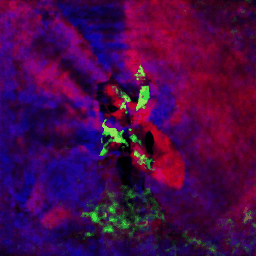

# Introduction
This project can generate a lot of illusion images. You can read more information about illusion in our final report, and this docement will tell you how to use this project.
# Environment
It's strongly recommended to run the project on a computer with gpu. And then you should follow the instructions below.  
1. You should install [Conda](https://www.anaconda.com/) and create a `Conda` environment
```
conda create --name illusion python=3.8
conda activate illusion
```
2. Install `PyTorch` according to your cuda version.
3. Make sure you have download the project completely.  
4. If you arn't running the project on an autodl remote server, delete the academic resource acceleration if it can't work on your computer. You can do that by removing the code below on all the `ipynb` file.
``` python
import subprocess
import os

result = subprocess.run('bash -c "source /etc/network_turbo && env | grep proxy"', shell=True, capture_output=True, text=True)
output = result.stdout
for line in output.splitlines():
    if '=' in line:
        var, value = line.split('=', 1)
        os.environ[var] = value
```
5. Our project can't run on a colab remote service since we havn't open souce our project on github, so the `ipynb` file will still try to download the old project when running on colab.
# Usage
We have six kinds of illutions, supporting prompts mixed with text and image. You can run our project by following the instructions below.
1. Open on of the `ipynb` files. And it's strongly recommended to open it by VSCode.
1. Run the whole `ipynb` file, the file will automatically download the requriments and the model. If you can't download the model from hugging face, please use a proxy.
1. And then you can see the results from the `ipynb` file, and the image and gif results will be saved at `untracked` folder.
1. If you want to modify the prompt, you can find text prompt by searching `prompt_[a-z]` using Regular Expression and find image prompt by searching `img_[a-z]` using Regular Expression.To modify the text prompt, directly modify the string or add your prompt in `source/example_prompts.yaml` and then using `rp.gather` to read it. To modify the image prompt, add your image at `img` folder and then modify the string to your image's path.
# Project gif Results






